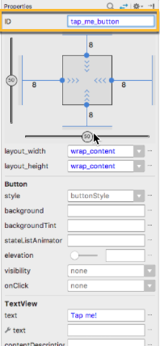
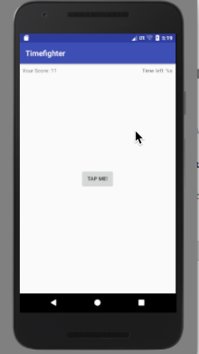

# Chapter 03: Activities

Column: May 04, 2019 4:38 PM
Description: Android apps are built around a set of screens that have a specific purpose. Each screen you see in an app is known as an Activity. An Activity is built around a single task that you want your user to perform.
FInished: No

# Resources

[Understand the Activity Lifecycle | Android Developers](https://developer.android.com/guide/components/activities/activity-lifecycle.html)

[String resources | Android Developers](https://developer.android.com/guide/topics/resources/string-resource.html)

# Getting Started

- Android IDs play a fundamental role in connecting Views back to the code.
- At build time, Android Studio take these IDs and turns them into constants your code can acces throught the R file

    

# Exploring Activities

`GameActivity.kt`

    package com.raywenderlich.timefighter
    
    import android.support.v7.app.AppCompatActivity
    import android.os.Bundle
    
    // 1 GameActivity extends AppCompatActivity which is required to deal with content
    // onscreen
    class GameActivity : AppCompatActivity() {
      // 2 onCreate is the entry point of Activities
      override fun onCreate(savedInstanceState: Bundle?) {
        // 3 Calling the base class's method is required because it must set up some 
    		// things first before your implementation executes.
        super.onCreate(savedInstanceState)
        // 4 Takes the layout you created and puts it on the device's screen
        setContentView(R.layout.activity_game)
      }
    }

`GameActivity.kt`

    package com.raywenderlich.timefighter
    
    import android.os.Bundle
    import android.os.CountDownTimer
    import android.support.v7.app.AppCompatActivity
    import android.widget.Button
    import android.widget.TextView
    import android.widget.Toast
    
    class GameActivity : AppCompatActivity() {
      internal lateinit var gameScoreTextView: TextView
      internal lateinit var timeLeftTextView: TextView
      internal lateinit var tapMeButton: Button
    
      override fun onCreate(savedInstanceState: Bundle?) {
        super.onCreate(savedInstanceState)
        setContentView(R.layout.activity_game)
        // connect views to variables
      }
    
      private fun incrementScore() {
        // increment score logic
      }
    
      private fun resetGame() {
        // reset game logic
      }
    
      private fun startGame() {
        // start game logic
      }
    
      private fun endGame() {
        // end game logic
      }
    }

# Hooking up the views

    // 1 findViewById() searches through your activity_game layout file to find the 
    // view with the corresponding ID
    gameScoreTextView = findViewById<TextView>(R.id.game_score_text_view)
    
    timeLeftTextView = findViewById<TextView>(R.id.time_left_text_view)
    
    tapMeButton = findViewById<Button>(R.id.tap_me_button)
    
    // 2 setOnClickListener() attaches a click listener to the Button which calls
    // incrementScore()
    tapMeButton.setOnClickListener { v -> incrementScore() }

Add a new variable to GameActivity and initialize it to 0

    internal var score = 0

Next replace the contents of `incrementScore()` with the following

    private fun incrementScore() {
    	score++
    
    	val newScore = "Your Score: " + Integer.toString(score)
    	gameScoreTextView.text = newScore
    }

# Managing strings in your app

String resources allow you to support multiple languages in your without being forced to write spaghetti code.

This also allows you to prevent strings from being sprinkled throughout your code.

`string.xml`

    <resources>
    	<string name="app_name">Timefighter</string>
    	<string name="tap_me">Tap me!</string>
    	<string name="your_score">Your Score: %s</string>
    	<string name="time_left">Time left: %s</string>
    	<string name="game_over_message">Times up! Your score was: %s</string>
    </resources>

In GameActivity, replace the contents of the `incrementScore()` method

    private fun incrementScore() {
    	score++
    
    	val newScore = getString(R.string.your_score, Integer.toString(score))
    	gameScoreTextView.text = newScore
    }

`getString()` is an Activity provided method that allows you to grab string from the R file name or ID. The strings reside in `strings.xml`

# Progressing the game

At the top of the GameActivity class add the following new properties underneath your View properties

    internal var gameStarted = false
    
    internal lateinit var countDownTimer: CountDownTimer
    internal var initialCountDown: Long = 6000
    internal var countDownInterval: Long = 1000
    internal var timeLeft = 60

In GameActivity, replace the contents of `resetGame()`

    private fun resetGame() {
    	// 1 Set the score to 0, convert it into a string, and use getString() to insert 
    	// the score value into your string stored in strings.xml. Then initailize the 
    	// TextView with this value
    	score = 0
    
    	val initialScore = getString(R.string.your_score, Integer.toString(score))
    	gameScoreTextView.text = initialScore
    
    	val initialTimeLeft = getString(R.string.time_left, Integer.toString(60))
    	timeLeftTextView.text = initialTimeLeft
    
    	// 2 Create a new CountDownTimer object and pass it into the initialCountDown and
    	// countDownInterval properties, which are set to 60000 and 1000 respectively. The
    	// CountDownTimer will count from 60 secs to 0 in 1 sec increments
    	countDownTimer = object : CountDownTimer(initialCountDown, countDownInterval) {
    		// 3 onTick() is called at every interval you passed into the timer. At each
    		// interval, the timeLeft property is updated with the time remaining
    		override fun onTick(millisUntilFinished: Long) {
    			timeLeft = millisUntilFinished.toInt() / 1000
    			
    			val timeLeftString = getString(R.string.time_left, Integer.toString(timeLeft))
    			timeLeftTextView.text = timeLeftString
    		}
    
    		override fun onFinish() {
    			// To Be Implemented Later
    		}
    	}
    	
    	// 4 Inform your gameStarted property that the game has not started by setting it
    	// false
    	gameStarted = false
    }

# Starting the game

Replace `startGame()` with the following

    // Inform the countdown timer to start. Also set gameStarted to true to
    // notitify any concerned parties that the game has started
    private fun startGame() {
    	countDownTimer.start()
    	gameStarted = true
    }

Add the following to the top of `incrementScore()`

    if (!gameStarted) {
    	startGame()
    }

# Ending the game

In `GameActivity` replace the `endGame()` method with the following

    private fun endGame() {
    	Toast.makeText(
    		this, 
    		getString(R.string.game_over_message,Integer.toString(score)), 
    		Toast.LENGTH_LONG).show())
    	resetGame()
    }

In `resetGame()` add the following to `onFinish()`

    endGame()